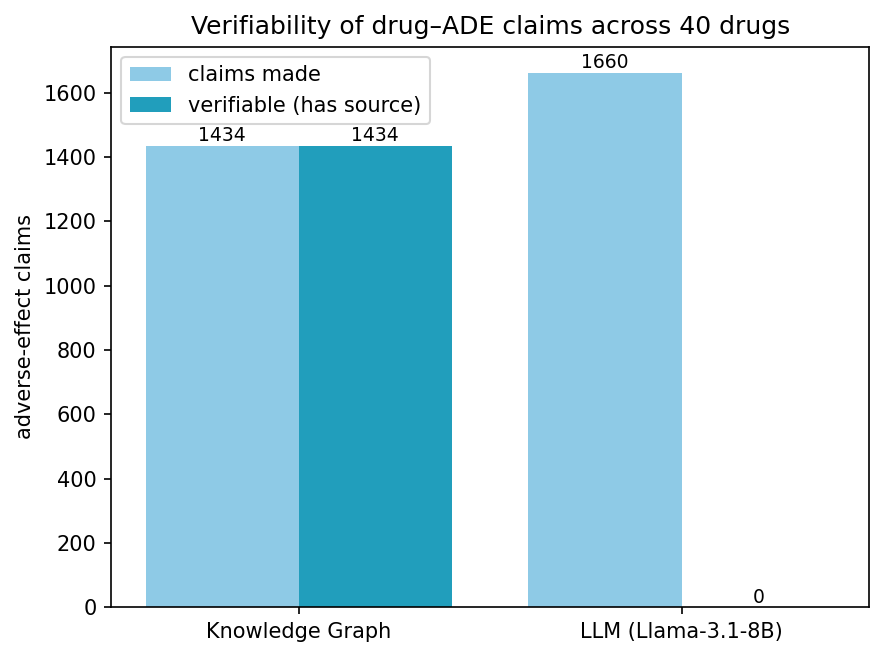

# drug-ade-knowledge-graph
 Provenance-Tracked Knowledge Graph for Drug–Adverse Event Extraction

Extracts drug -> adverse-effect relations from biomedical case-report text, assembles them
into a knowledge graph where every edge carries its source sentence, and quantifies why
graph-grounded answers are verifiable where a raw LLM's answers are not.

## Result

Across 40 drugs, the KG made 1,434 adverse-effect claims — every one traceable to a source
sentence. Llama-3.1-8B made 1,660 claims for the same drugs — none traceable to any source.

The point is not that the LLM is wrong (many of its claims are real pharmacology). It is that
its assertions cannot be verified: you cannot tell which of the 1,660 to trust. The KG makes
fewer claims but each is checkable against the sentence that justifies it.

## Pipeline

1. **Sentence classifier** — DistilBERT fine-tuned on ADE Corpus v2 to flag ADE-bearing
   sentences (test macro-F1 0.90, ADE-class F1 0.84). Dedup-before-split to prevent the
   sentence-duplication leakage in this corpus.
2. **Co-occurrence extraction** — within an ADE sentence, drug–effect co-occurrence recovers
   the gold relations at 0.99 precision / 1.00 recall. Measured, not assumed: on single-entity
   sentences precision is 1.00; all false positives (69) fall in multi-entity sentences.
   A trained relation classifier was evaluated and rejected — the corpus yields only 69 hard
   negatives (97:1 imbalance), too few to train a disambiguator that could beat co-occurrence.
3. **Entity linking** — drug surface forms resolved to RxNorm RxCUIs via the NLM RxNorm API
   (normalized match, which expands abbreviations: mtx -> methotrexate). 103 fragmented drug
   nodes merged; 75% of 1,047 drug strings mapped (unmapped = foreign names, drug classes,
   combinations, kept as-is rather than fuzzy-merged).
4. **Knowledge graph** — 3,927 nodes, 5,076 edges. Every edge stores its source sentences,
   support count, and a confidence tier (1.0 for single-entity-sentence edges, 0.982 for
   multi-entity).
5. **Grounding experiment** — KG vs raw LLM on "what adverse effects does drug X cause",
   scored on verifiability (fraction of claims with a checkable source).

## Data

ADE Corpus v2 (Gurulingappa et al., 2012), a benchmark of MEDLINE case-report sentences.
Used as a research benchmark; cite the source paper.

## Known limitations / future work

- Result is on a curated corpus pre-selected for ADE relevance. On raw PubMed text,
  co-occurrence precision would drop (unrelated drug/effect co-mentions) — this is where a
  trained relation classifier would earn its place. Stress test on raw abstracts is the
  natural next step.
- 25% of drug strings unmapped to RxNorm; effect-side entity linking (to MedDRA/UMLS) not
  yet done.
- Corpus is not exhaustive per drug, so LLM claims absent from it are not necessarily wrong.

## Stack

Python, HuggingFace Transformers (DistilBERT), NetworkX, scikit-learn, RxNorm API, Groq
(Llama-3.1-8B). Runs on free Colab.
"""
